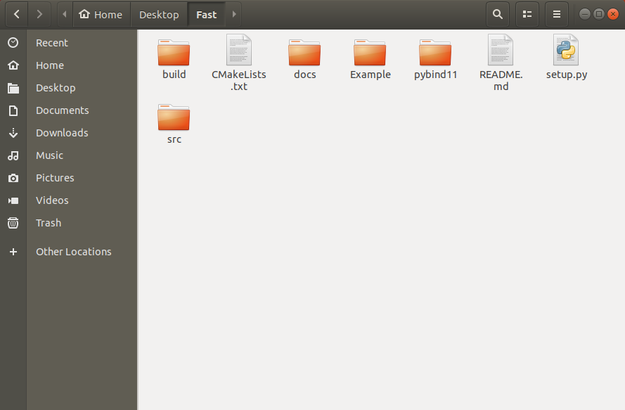

# Fast
A library for Linear Algebra Calculations (In Progress). **__Fast__** allows users to perform linear algebra calculations in *python* faster than native *python* language or even `Numpy` since **__Fast__** uses [**PyBind11**](https://github.com/pybind/pybind11) to wrap C++ code into a *python* object. Furthermore, **__Fast__** utilises [**Eigen3**](http://eigen.tuxfamily.org/index.php?title=Main_Page) Library which specialises in linear algebra calculations and [**OpenMP**](https://www.openmp.org/wp-content/uploads/OpenMP-4.5-1115-CPP-web.pdf) to allow parallel matrix calculations to boost performance.

## System Requirements:
1. Python 3.x
2. C++ 11.0
3. OpenCL and Grpahics Drivers depending on the User's Graphics Card
4. PyBind11
5. Eigen3 Library


## Quick Installation 
If all the aforementioned systems requirements have been met, you can do a quick installtion and use the **__Fast__** Library, else it is highly recommended that you follow the **full installtion procedure** before this step. 

### Step to Take:

1.  Clone **__Fast__**  repository to your preferred location.

2.  Clone [**PyBind11**](https://github.com/pybind/pybind11) into the **__Fast__** Folder as shown below:
Inline-style:


3.  Open Terminal and go to the **__Fast__** directory e.g.
```linux
user@user:~$ cd Desktop/Fast
user@user:~/Desktop/Fast$
```

4.  Install the Library! 
..* For the parameter it is advised to use `develop` if users wish to customise the functions available in the library. However users can also use `install` as a parameter.
```
user@user:~/Desktop/Fast$ python setup.py [Parameter]
```

